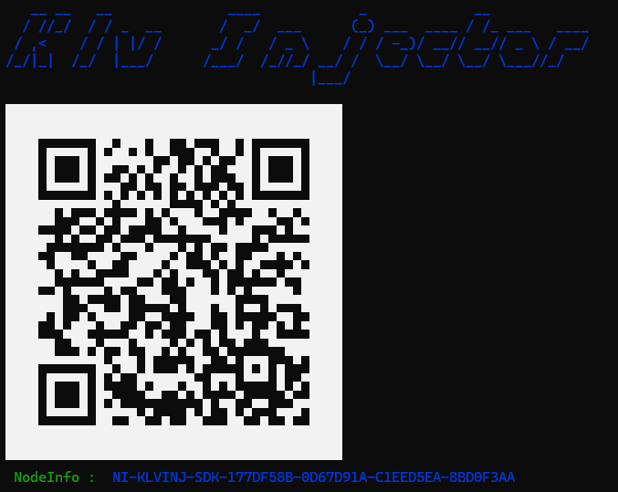

<div align="center">
  <a >
    
  </a>
</div>

# KLV Injector SDK.NET
**KLV Injector SDK.NET** is an "ITAR-free" library that provides stream/file playback and MISB KLV extraction/decoding functionality.  
More [info](https://impleotv.com/products/sdks/klvinjectorsdk-net/).

## System Requirements
OS: Windows 10/11 64 bit.

## Installation

**KLV Injector SDK.NET** can be downloaded as a **zip** file that contains the installer. Unzip the **SetupStanagInjectorSDK.Net.zip** file and run the **SetupStanagInjectorSDK.Net.exe**.  
The corresponding version of a low-level binaries **StCore setup** (for redistribution) is also provided, along with the SDK. 

## Download links

| Software | Version              | Download link                                                           | 
|:-----|:-------------------------|:------------------------------------------------------------------------------|
| **KLV Injector SDK.NET**  |  v4.3.0 | [SetupStanagInjectorSDK.Net.zip](https://github.com/impleotv/klv-injector-sdk-release/releases/latest/download/SetupStanagInjectorSDK.Net.zip) | 
| **StCore**  |   | [StCoreSetup-x64.zip](https://github.com/impleotv/klv-injector-sdk-release/releases/latest/download/StCoreSetup-x64.zip) | 

*Released on Sun, 31 Aug 2025, 17:39 GMT+3*

## License

No license is needed for SDK evaluation - it will work in demo mode (with some restrictions, like a maximum limit on the number of processed packets and support for only lower tags (<15)).

**KLV Injector SDK.NET** is a node-locked software, so you have to get a license (**after purchasing the SDK**) in order to lift demo restrictions. Please install it and fill out an [online form](https://docs.google.com/forms/d/e/1FAIpQLSd_XW6bDsFce1G1cpds4gMQNlwNax0CvkWzcMbscxZ5rLaIbA/viewform), providing the ***Node Info*** string (IMPORTANT!!!) for the target machine.  
***Node Info*** string can be seen when you run the demo app, as shown below.  

```
C:\Program Files\ImpleoTV\StanagInjectorSdkNet\Samples\KlvInjectorTestApp\bin\KlvInjectorTestApp.exe
```

<div align="center">
  <a >
    
  </a>
</div>  

Copy and paste the **Node Info** string into the online form, or email it to support@impleotv.com.  
If your computer is offline or you're unable to copy the Node Info text, take a photo of the window with the QR code clearly visible and send it to us instead.

You'll receive a license file (or both a license file and a key for legacy licensing mechanism) that can be utilized in the Activate method.

> For large quantities, please contact us for an **unlocked license**.